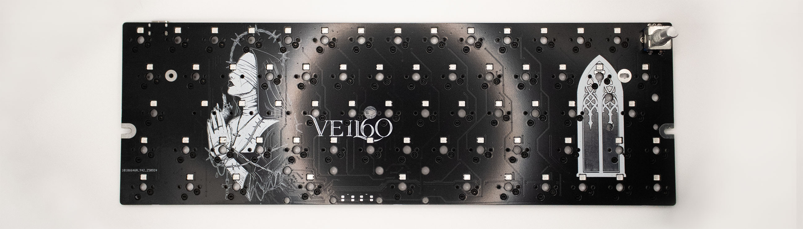
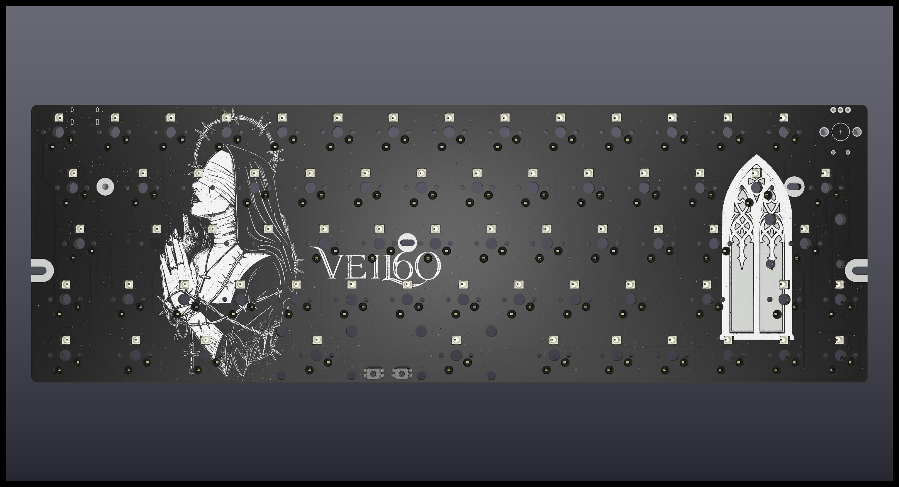
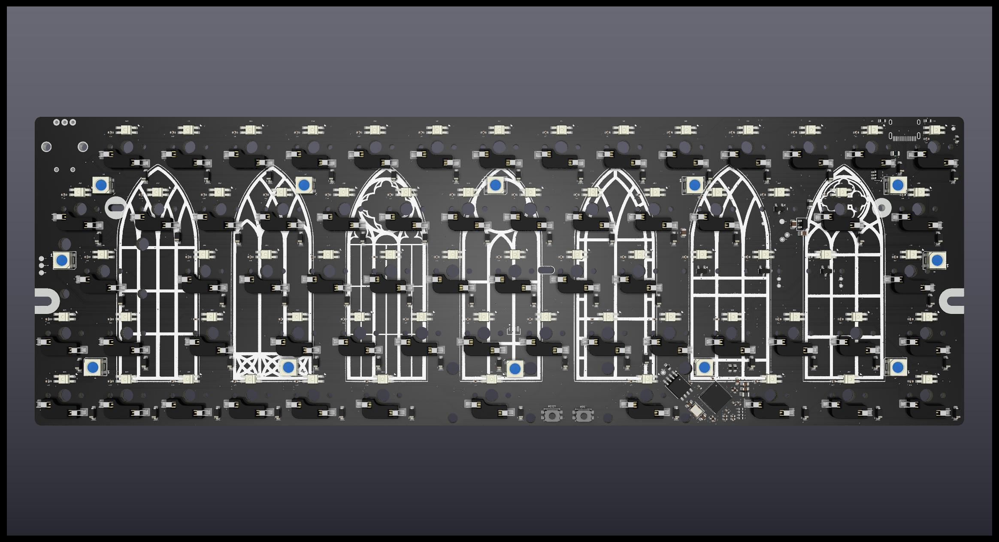
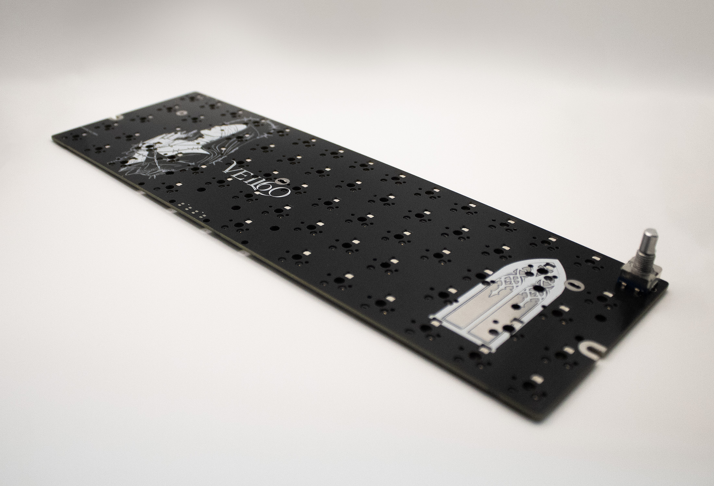

# The Veil 60% Keyboard

## Features and Information
- 66 key 60% layout, compatible with 3rd party cases.
- QMK + VIA
- Split space (2.75U + 2.25U + 1.25U)
- WASD are Hall effect sensors with SOCD.
- Custom VIA keycodes for printing ADC values to QMK Toolbox HID Console for calibration
- Fully remappable encoder knob.
- Arrow key cluster
- ISO backslash
- SignalRGB supported
- North-facing RGB
- 12 Underglow LEDS

### [KLE Layout](https://www.keyboard-layout-editor.com/#/gists/70c935bfc0dd9d3efd5b4094877e21a2)

PCB Front

PCB Back

